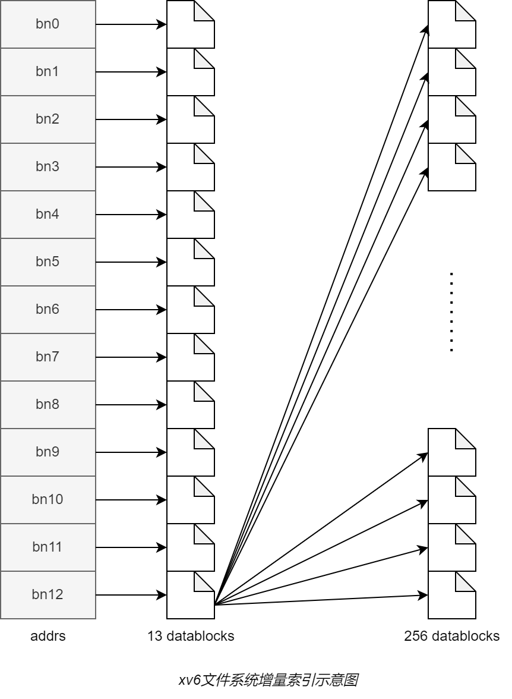

## 磁盘

### 磁盘的布局

**sector: **磁盘存取的最小单位。在xv6中为1kb

**block: **文件系统存取的最小单位，为sector的任意整数倍。在xv6中为1kb


- boot block: 启动操作系统的代码
- super block: 描述文件系统信息
- log blocks: 
- inode blocks: 存放所有inode
- bitmap block: 记录data block是否空闲
- data blocks: 存储文件和目录的内容

### supber block

```c
	// kernel/fs.h
14	struct superblock {
15	  uint magic;        // Must be FSMAGIC
16	  uint size;         // Size of file system image (blocks)
17	  uint nblocks;      // Number of data blocks
18	  uint ninodes;      // Number of inodes.
19	  uint nlog;         // Number of log blocks
20	  uint logstart;     // Block number of first log block
21	  uint inodestart;   // Block number of first inode block
22	  uint bmapstart;    // Block number of first free map block
23	};
```

```c
#define FSSIZE       2000  // size of file system in blocks
#define MAXOPBLOCKS  10  // max # of blocks any FS op writes
#define LOGSIZE      (MAXOPBLOCKS*3)  // max data blocks in on-disk log
#define NINODES 200
```

```c
	// kernel/fs.c
	// there should be one superblock per disk device, 
	// but we run with only one device
27	struct superblock sb; 

40	// Init fs
41	void
42	fsinit(int dev) {
43	  readsb(dev, &sb);
44	  if(sb.magic != FSMAGIC)
45	    panic("invalid file system");
46	  initlog(dev, &sb);
47	}

29	// Read the super block.
30	static void
31	readsb(int dev, struct superblock *sb)
32	{
33	  struct buf *bp;
34	
35	  bp = bread(dev, 1);
36	  memmove(sb, bp->data, sizeof(*sb));
37	  brelse(bp);
38	}
```

## 一些结构

```c
		// kernle/file.h
		// 文件控制块
	1	struct file {
  2	  enum { FD_NONE, FD_PIPE, FD_INODE, FD_DEVICE } type;
  3	  int ref; // reference count
  4	  char readable;
  5	  char writable;
  6	  struct pipe *pipe; // FD_PIPE
  7	  struct inode *ip;  // FD_INODE and FD_DEVICE
  8	  uint off;          // FD_INODE
  9	  short major;       // FD_DEVICE
10	};
```

```c
		// kernel/fs.h
		// 磁盘索引结点
32	struct dinode {
33	  short type;           // File type
34	  short major;          // Major device number (T_DEVICE only)
35	  short minor;          // Minor device number (T_DEVICE only)
36	  short nlink;          // Number of links to inode in file system
37	  uint size;            // Size of file (bytes)
38	  uint addrs[NDIRECT+1];   // Data block addresses
39	};
		#define NDIRECT 12
```

```c
		// kernel/file.h
		// 内存索引结点
17	struct inode {
18	  uint dev;           // Device number
19	  uint inum;          // Inode number
20	  int ref;            // Reference count
21	  struct sleeplock lock; // protects everything below here
22	  int valid;          // inode has been read from disk?
23	
24	  short type;         // copy of disk inode
25	  short major;
26	  short minor;
27	  short nlink;
28	  uint size;
29	  uint addrs[NDIRECT+1];
30	};
```

```c
		// kernel/fs.h
		// 目录项
57	struct dirent {
58	  ushort inum;
59	  char name[DIRSIZ];
60	};
```

### addition

**Major number** (主设备号)

> Traditionally, the major number identifies the driver associated with the device. A major number can also be shared by multiple device drivers.

**Minor number** (次设备号)

> The major number is to identify the corresponding driver. Many devices may use the same major number. So we need to assign the number to each device that is using the same major number.



## 目录查询


```c
		// kernel/fs.c
651	static struct inode*
652	namex(char *path, int nameiparent, char *name)
653	{
654	  struct inode *ip, *next;
655	
656	  if(*path == '/')
657	    ip = iget(ROOTDEV, ROOTINO);
658	  else
659	    ip = idup(myproc()->cwd);
660	
661	  while((path = skipelem(path, name)) != 0){
662	    ilock(ip);
663	    if(ip->type != T_DIR){
664	      iunlockput(ip);
665	      return 0;
666	    }
667	    if(nameiparent && *path == '\0'){
668	      // Stop one level early.
669	      iunlock(ip);
670	      return ip;
671	    }
672	    if((next = dirlookup(ip, name, 0)) == 0){
673	      iunlockput(ip);
674	      return 0;
675	    }
676	    iunlockput(ip);
677	    ip = next;
678	  }
679	  if(nameiparent){
680	    iput(ip);
681	    return 0;
682	  }
683	  return ip;
684	}
```

## open系统调用

### open

```c
25	void
26	ls(char *path)
27	{
28	  char buf[512], *p;
29	  int fd;

33	  if((fd = open(path, 0)) < 0){
34	    fprintf(2, "ls: cannot open %s\n", path);
35	    return;
36	  }
```

```c
int open(const char* file, int omode);
```

- file: 文件名，相对路径和绝对路径

- omode: 打开方式

  | omode    | value | 描述 |
  | -------- | ----- | ---- |
  | O_RDONLY | 0     | 只读 |
  | O_WRONLY | 1<<0  | 只写 |
  | O_RDWR   | 1<<1  | 读写 |
  | O_CREATE | 1<<9  | 新建 |
  | O_TRUNC  | 1<<10 | 删除 |

- 返回值: 一个整数表示文件描述符，打开失败返回-1

### sys_open

```c
		// kernel/sysfile.c
304	uint64
305	sys_open(void)
306	{
307	  char path[MAXPATH];
308	  int fd, omode;
309	  struct file *f;
310	  struct inode *ip;
311	  int n;
312	
  		// 取参数
313	  argint(1, &omode);
314	  if((n = argstr(0, path, MAXPATH)) < 0)
315	    return -1;
316	
  		// 表示开始一个事务
317	  begin_op();
318	
319	  if(omode & O_CREATE){
320	    ip = create(path, T_FILE, 0, 0);
321	    if(ip == 0){
322	      end_op();
323	      return -1;
324	    }
325	  } 
  		// 不需要新建
  		else {
        // 获取目标文件的inode
326	    if((ip = namei(path)) == 0){
327	      end_op();
328	      return -1;
329	    }
330	    ilock(ip);
        // 目录只能以只读方式打开
331	    if(ip->type == T_DIR && omode != O_RDONLY){
332	      iunlockput(ip);
333	      end_op();
334	      return -1;
335	    }
336	  }
337	
  		// 设备文件
338	  if(ip->type == T_DEVICE && (ip->major < 0 || ip->major >= NDEV)){
339	    iunlockput(ip);
340	    end_op();
341	    return -1;
342	  }
343	
  		// 分配文件控制块和文件描述符
344	  if((f = filealloc()) == 0 || (fd = fdalloc(f)) < 0){
345	    if(f)
346	      fileclose(f);
347	    iunlockput(ip);
348	    end_op();
349	    return -1;
350	  }
351	
  		// 设备文件
352	  if(ip->type == T_DEVICE){
353	    f->type = FD_DEVICE;
354	    f->major = ip->major;
355	  } 
  		// 文件或目录
  		else {
356	    f->type = FD_INODE;
357	    f->off = 0;
358	  }
359	  f->ip = ip;
  		// 非只写
360	  f->readable = !(omode & O_WRONLY);
  		// 只写或可读可写
361	  f->writable = (omode & O_WRONLY) || (omode & O_RDWR);
362		
  		// 删除文件
363	  if((omode & O_TRUNC) && ip->type == T_FILE){
364	    itrunc(ip);
365	  }
366	
367	  iunlock(ip);
  		// 结束一个事务
368	  end_op();
369		
  		// 返回文件描述符
370	  return fd;
371	}
```

### create

```c
		// kernel/sysfile.c
245	static struct inode*
246	create(char *path, short type, short major, short minor)
247	{
248	  struct inode *ip, *dp;
249	  char name[DIRSIZ];
250	
  		// struct inode* nameiparent(char *path, char *name)
  		// 返回path的父目录的inode和目标文件的name
  		// e.g., path="/etc/apt/config"
  		// dp = inode("/etc/apt/")
  		// name = "config"
251	  if((dp = nameiparent(path, name)) == 0)
252	    return 0;
253	
254	  ilock(dp);
255	
  		// struct inode* dirlookup(struct inode *dp, char *name, uint *poff)
  		// 查询dp目录下name文件的inode
256	  if((ip = dirlookup(dp, name, 0)) != 0){
257	    iunlockput(dp);
258	    ilock(ip);
259	    if(type == T_FILE && (ip->type == T_FILE || ip->type == T_DEVICE))
260	      return ip;
261	    iunlockput(ip);
262	    return 0;
263	  }
264	
  		// 若文件不存在
  		// 分配inode
265	  if((ip = ialloc(dp->dev, type)) == 0){
266	    iunlockput(dp);
267	    return 0;
268	  }
269	
  		// 设置inode
270	  ilock(ip);
271	  ip->major = major;
272	  ip->minor = minor;
273	  ip->nlink = 1;
  		// 将ip写入到磁盘
274	  iupdate(ip);
275	
  		// 目录文件
276	  if(type == T_DIR){  // Create . and .. entries.
277	    // No ip->nlink++ for ".": avoid cyclic ref count.
278	    if(dirlink(ip, ".", ip->inum) < 0 || dirlink(ip, "..", dp->inum) < 0)
279	      goto fail;
280	  }
281	
			// 添加目录项
282	  if(dirlink(dp, name, ip->inum) < 0)
283	    goto fail;
284	
285	  if(type == T_DIR){
286	    // now that success is guaranteed:
287	    dp->nlink++;  // for ".."
288	    iupdate(dp);
289	  }
290	
291	  iunlockput(dp);
292	
  		// 未释放ip的锁
293	  return ip;
294	
295	 fail:
296	  // something went wrong. de-allocate ip.
297	  ip->nlink = 0;
298	  iupdate(ip);
299	  iunlockput(ip);
300	  iunlockput(dp);
301	  return 0;
302	}
```

## 
