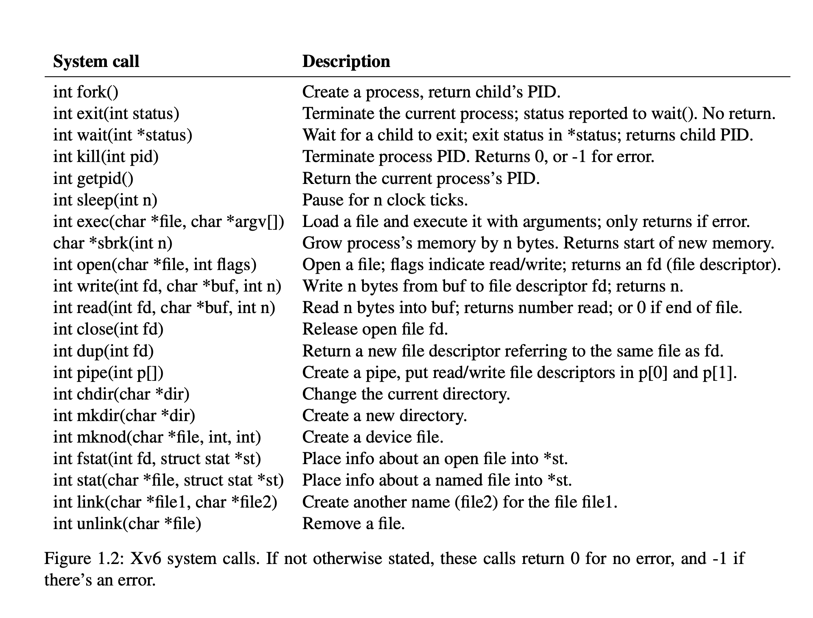

### 3. System call

- **user.h**



- **syscall.h**

| System call | System call number |
| ----------- | ------------------ |
| fork        | 1                  |
| exit        | 2                  |
| wait        | 3                  |
| pipe        | 4                  |
| read        | 5                  |
| kill        | 6                  |
| exec        | 7                  |
| fstat       | 8                  |
| chdir       | 9                  |
| dup         | 10                 |
| getpid      | 11                 |
| sbrk        | 12                 |
| sleep       | 13                 |
| uptime      | 14                 |
| open        | 15                 |
| write       | 16                 |
| mknod       | 17                 |
| unlink      | 18                 |
| link        | 19                 |
| mkdir       | 20                 |
| close       | 21                 |

- **syscall.c**

```c
// Prototypes for the functions that handle system calls.
extern uint64 sys_func(void);
...

static uint64 (*syscalls[])(void) = {
  [SYS_fork] sys_fork,
  ...
};

void syscall(void) {
  int num;
  struct proc *p = myproc();
  num = p->trapframe->a7;
  ...
}
```

### 4. Kernel (Supervisor) mode

- **usertrapret (trap.c)**: Sets up the RISC-V control registers to prepare for a future trap from user space. (ecall 的逆操作)
    - [关中断](https://developer.aliyun.com/article/289082#:~:text=%E5%85%B3%E4%B8%AD%E6%96%AD%E5%B0%B1%E6%98%AF%E4%B8%BA%E4%BA%86%E8%AE%A9,%E5%86%8D%E7%9B%B8%E5%BA%94%E5%85%B6%E4%BB%96%E7%9A%84%E8%AF%B7%E6%B1%82%E3%80%82) `intr_off();`
    - 更新 `stvec` 指向用户空间的 trap 处理代码, 设置了 `stvec` 指向 trampoline, 在那里执行 `sret` 返回到 user address space
    - 填入 trapframe 内容 (恢复现场)
        - 存储 kernel page table pointer (`kernel_satp`)
        - 存储当前用户进程的 kernel stack (`kernel_sp`, stack pointer)
        - 存储 usertrap 函数指针, 使得 trampoline 代码能够跳转到 (`kernel_trap = usertrap`)
        - 从 `tp` 中读取当前的CPU核编号 (`kernel_hartid`), 存储在 trapframe 中, 使得 trampoline 代码能够恢复这个数字, 因为用户代码可能会修改它
- **userret (trampoline.S)**: Switches satp to the process’s user page table. kernel 中最后一条指令
    - 程序切换回 user mode
    - `$sepc` 的数值会被 copy 到 `pc`
    - sret 重新打开中断
