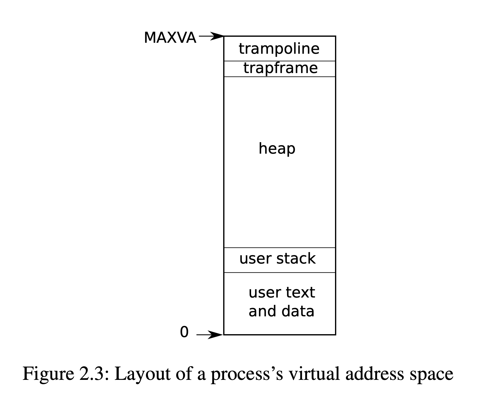

### 1. Trap

> Kernel code (assembler or C) that processes a trap is often called a ***handler***; the first handler instructions are usually written in assembler (trampoline.S, rather than C) and are called a ***vector***.

#### Popular names

- **kernel mode**: 内核态

- **user mode**: 用户态

- **supervisor**: 在内核态工作的具有较高权限的管理者身份

- **user**: 与计算机进行***交互***的普通用户身份 🧑🏻‍💻 <=> 💻

- **stvec**: The ***kernel*** writes the <u>***address***</u> of its trap handler here; the RISC-V jumps to the address in *stvec* to handle a trap. (指向了内核中处理 trap 的指令的起始地址)

- **sepc**: When a trap occurs, RISC-V saves the *<u>**program counter**</u>* here (since the pc is then overwritten with the value in *stvec*).

- **sret**: The sret (*<u>**return**</u>* from trap) instruction copies *sepc* to the pc. The ***kernel*** can write *sepc* to control where *sret* goes.

- **scause**: RISC-V puts a number here that describes the **<u>*reason*</u>** for the trap. (***exception***, ***system call***, ***device interrupt***)

- **sscratch**: (Supervisor mode scratch) Helps trap handler avoid over writing user registers before saving them. (🌟 OS 留了一个 reg 在自己手上, 对用户进程不可见.)

- **sstatus**: The ***SIE*** bit in sstatus controls whether device interrupts are enabled. If the kernel clears SIE (**0**), the RISC-V will defer device interrupts until the kernel sets SIE (**1**). The ***SPP*** bit indicates whether a trap came from user mode (**0**) or supervisor mode (**1**), and controls to what mode *sret* returns.

    ```c
    SSTATUS [SPP _ _ SPIE UPIE _ _ SIE UIE]
              ^  ^ ^  ^    ^   ^ ^  ^   ^
              8  7 6  5    4   3 2  1   0
    ```

- **satp**: (Supervisor mode address translation and protection) Tells trampoline the ***<u>user/supervisor page table</u>*** to switch to. (包含了指向 page table 的物理内存地址)

- **uservec**: Saves ***<u>user registers</u>*** in the trapframe, an assembly function.

- **TRAPFRAME** (`0x3fffffe000`, 保存进程寄存器现场的内存) and **TRAMPOLINE** (`$stvec = 0x3ffffff00`, Read-only, 跳板)

    

- **memlayout.h**

    ```c
    // User memory layout
    // Address zero first:
    //   text
    //   original data and bss
    //   fixed-size stack
    //   expandable heap
    //   ...
    //   TRAPFRAME (p->trapframe, used by the trampoline)
    //   TRAMPOLINE (the same page as in the `kernel`)
    
    // Map the trampoline page to the highest address,
    // in both user and kernel space.
    #define TRAMPOLINE (MAXVA - PGSIZE)
    
    // TRAPFRAME is the next page of TRAMPOLINE
    #define TRAPFRAME (TRAMPOLINE - PGSIZE)
    ```

- **PTE_U**: flag determines whether the user mode can use current page table. ***PTE_U = 0: Supervisor, 1: User***

- **proc.h**

    > **struct trapframe & 32 regs**
    >
    > **Good practice**
